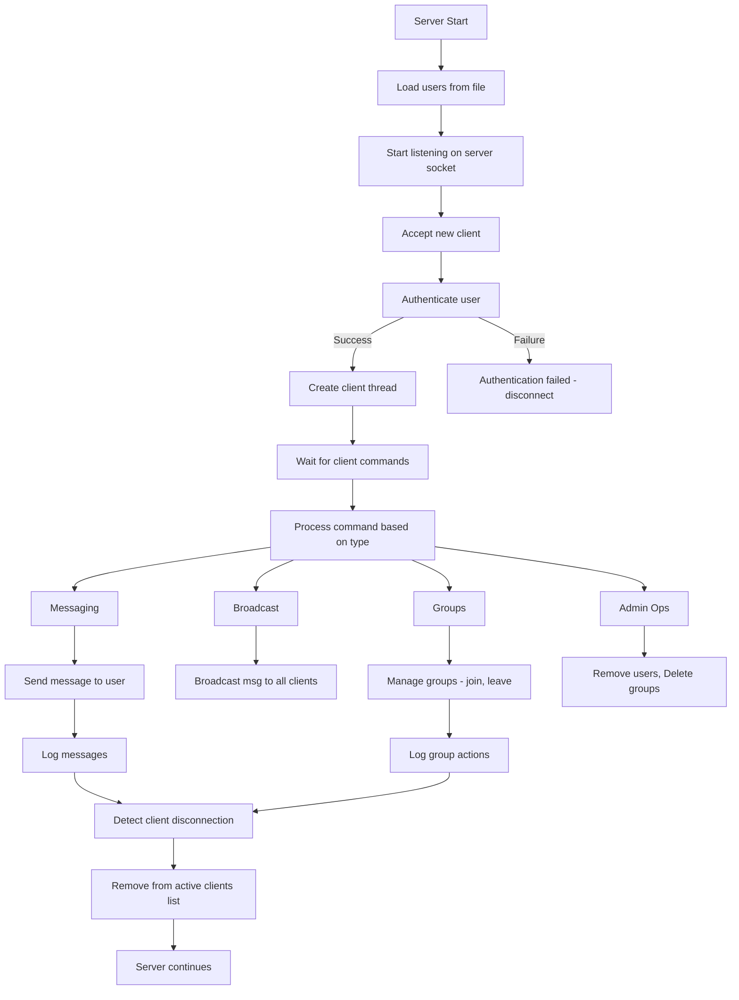

# Assignment-1 : Chat Server with Groups


### Features Implemented

- User authentication from `users.txt`
- Private messaging
- Broadcast messaging
- Group creation, joining, and messaging
- Admin functionalities (removing members, deleting groups)
- Multi-threaded client handling
- Command-based interaction
- Graceful client disconnection handling
- Logging of server activity

## Design Decisions

### Multi-threading Model & Synchronization

- Created a new thread for each connection to handle multiple clients concurrently.
- Used `thread` to manage client interactions.
- Used `mutex` to protect shared resources like `clients`, `groups` and `admins`.

### Error Handling

Handled incorrect authentication, invalid commands, and disconnected clients.

Sent error messages when commands failed.

Implemented logging for debugging and tracking user activity.

## Implementation

1. **Authentication**: Clients must provide a valid username and password stored in `users.txt`.
2. **Messaging**:
   - `/msg <username> <message>` for private messages.
   - `/broadcast <message>` for global messages.
   - `/group_msg <group_name> <message> `for group communication.
3. **Group Management**:
   - `/create_group <group_name>`to create a group.
   - `/join_group <group_name>`to join a group.
   - `/remove_member <group_name> <username>`(admin only) to remove a member.
   - `/leave_group <group_name>` to leave a group.
4. **Logging**:
   - Logs all messages and administrative actions.
   - Helps in debugging and tracking server activity.
5. **Graceful Client Disconnection**:
   - Detects client disconnects and removes them from active users.

#### Project implementation flowchart :



## Testing

- Verified user authentication.
- Tested all messaging commands.
- Simulated multiple concurrent clients.

### Stress testing

Performed stress testing on the server using `wrk`

- `-t12`: Use 12 threads to generate requests.
- `-c400`: Use 400 connections.
- `-d30s`: Run the test for 30 seconds.

  Below are the results-

  ```
  Running 30s test @ http://127.0.0.1:12345
  12 threads and 400 connections
  Thread Stats   Avg      Stdev     Max   +/- Stdev
  Latency     0.00us    0.00us   0.00us     nan%
  Req/Sec     0.00      0.00     0.00       nan%
  0 requests in 30.10s, 0.00B read
  Socket errors: connect 155, read 630079, write 753107, timeout 0
  Requests/sec:      0.00
  Transfer/sec:       0.00B
  ```

## Restrictions

- Max clients: Limited by system resources.
- Max groups: Limited by `unordered_map` size.
- Max members per group: No explicit limit.
- Max message size: 1024 bytes.
- No automatic reconnection for disconnected clients.

# Instructions for Running the Server and Client

#### 1. Compile the Server and Client:

Run the following commands to compile the server and client code:

```bash
g++ -std=c++17 -o server server_grp.cpp -pthread
g++ -std=c++17 -o client client_grp.cpp -pthread
```

This will generate two executables: `server` and `client`.

#### 2. Start the Server:

Run the server in one terminal:

```bash
./server
```

**Expected Output:**

```
Server started on port 12345.
```

#### 3. Start Clients:

Open new terminal windows for each client and run the following command:

```bash
./client
```

For each client, you should see:

```
Connected to the server.
Enter username:
```

4. Test Login:

Enter the username and password from `users.txt`. For example:

**Client 1:**

```
Enter username: <user_name1>
Enter password: <password1>
```

**Expected Output:**

```
Welcome to the chat server!
```

**Client 2:**

```
Enter username: <user_name2>
Enter password: <password2>
```

**Expected Output:**

```
Welcome to the chat server!
<user_name1> has joined the chat.
```

#### 5. Test Commands:

After logging in, test the following commands:

###### 5.1 Broadcast a message:

```bash
/broadcast Hello, everyone!
```

All connected clients should receive:

```
<user_name1>: Hello, everyone!
```

###### 5.2 Private message:

```bash
/msg <user_name2> Hi, <user_name2>!
```

Only <user_name2> should receive:

```
<user_name1>: Hi, <user_name2>!
```

###### 5.3 Create a group:

```bash
/create_group <group_name>
```

Expected Output:

```
Group <group_name> created.
```

###### 5.4 Join a group:

```bash
/join_group <group_name>
```

Expected Output:

```
You joined the group <group_name>.
```

###### 5.5 Group message:

```bash
/group_msg <group_name> Hi, group!
```

All members of `<group_name>` should see:

```
[<group_name>] <user_name1>: Hi, group!
```

###### 5.6 Remove a member from a group:

```bash
/remove_member <group_name> <member_name>
```

Expected Output:

```
<member_name> has been removed from group <group_name>.
```

###### 5.7 Leave a group:

```bash
/leave_group <group_name>
```

Expected Output:

```
Left group <group_name>.
```

###### 5.8 Exit the chat:

```bash
/exit
```

The client disconnects, and other clients see:

```
<user_name1> has left the chat.
```

```bash

g++ -std=c++17 -o server_grp server_grp.cpp -pthread
g++ -std=c++17 -o client_grp client_grp.cpp -pthread
```

## Contribution

| Member  | Contribution (%) | Areas of Contribution                                                                                                                                                                                                              |
| ------- | ---------------- | ---------------------------------------------------------------------------------------------------------------------------------------------------------------------------------------------------------------------------------- |
| Harshit | 50%              | Designed system architecture, implemented core functionalities including<br />multi-threading and synchronization, and worked on logging mechanisms <br />and user authentication. <br />Contributed to testing and documentation. |
| Ananya  | 50%              | Worked on messaging commands, user authentication and group<br />management features. <br />Conducted testing, debugged issues, and <br />contributed to documentation.                                                            |

## References

- [C++ documentation ](https://en.cppreference.com/w/cpp/thread/thread)(cppreference.com)
- Socket programming tutorials

## Declaration

We declare that this project is our own work and we have not indulged in plagiarism.

## Feedback

- A GUI-based client could be an interesting extension.
- Can implement encrypted communication.
